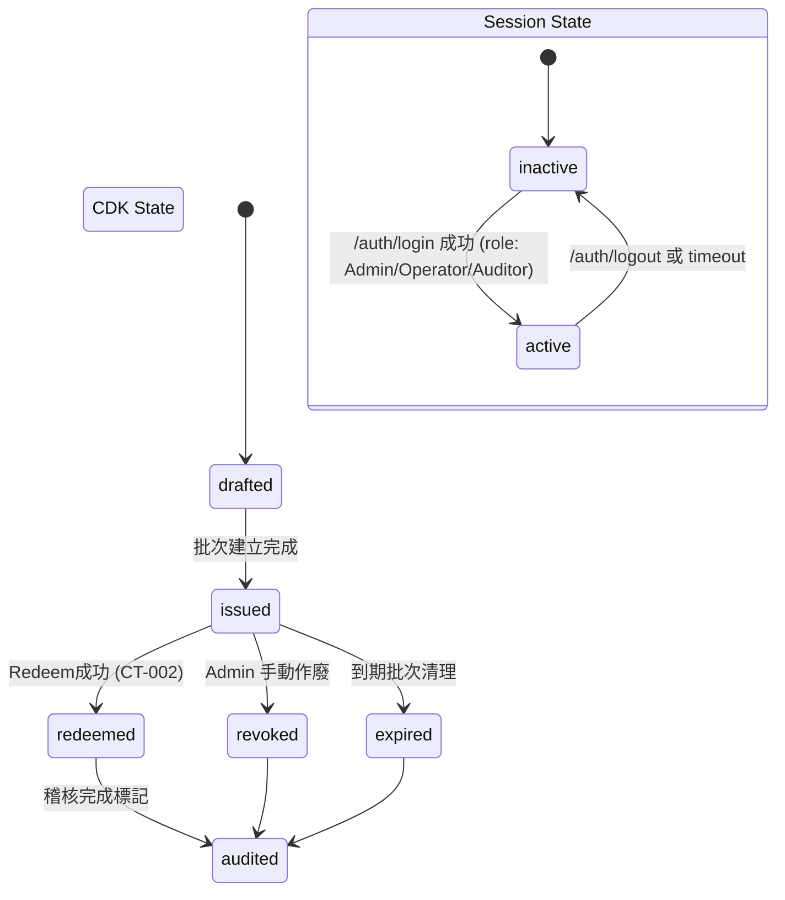

# Feature Specification: Taisafe-CDK 核心系統

**Feature Branch**: `[001-taisafe-cdk-core]`  
**Created**: 2025-11-07  
**Status**: Draft  
**Input**: User description: "我要做一個叫 Taisafe-CDK是 一套企業內部使用的「電子序號（CDK）」管理系統， 用於企業產品或行銷活動中的序號建立、管理與核銷。 有登錄和登出功能。"

## Goal *(mandatory)*

建立一套以規格驅動的序號生命週期管理核心，涵蓋批量建立、核銷、查詢、稽核與登入控制，確保：  
- **穩定**：原生 PHP 8.3 + MySQL 5.7 + Nginx + Bootstrap 5 + HTMX + Hyperscript，兼容寶塔面板部署。  
- **安全與可審計**：所有操作留痕於 `audit_log`，輸入驗證與 Session 控制符合憲章。  
- **可稽核**：每個模組的輸入輸出契約、狀態、錯誤情境在此規格明確定義，供 `/speckit.plan` 與 `/speckit.tasks` 使用。

## System Objectives

1. 提供批量序號建立與格式管理，支援 10,000 筆以上生成。  
2. 提供可靠的序號核銷流程，記錄操作者、地點與時間。  
3. 提供多維查詢、狀態檢視與批次報表，支援 CSV 導出。  
4. 確保登入/登出與角色權限（Admin / Operator / Auditor / Guest）行為一致。  
5. 提供稽核報表與內部匯出端點，讓審計人員可追溯所有敏感操作。

**Out-of-Scope**：第三方整合或公開 API 核銷；多因子驗證工作流。

## Clarifications

### Session 2025-11-07

- Q: 序號格式模板是否允許巢狀占位符（如 `{DATE:{TZ}}`）？ → A: 僅允許單層占位符（如 `{DATE}`、`{RANDOM4}`、`{SEQ}`），不支援巢狀或函式化語法。
- Q: 是否提供對外 API 給第三方核銷？需要 IP 白名單或 API Key？ → A: 僅支援內部 Web 介面與現有模組，不提供對外核銷 API。
- Q: 是否需要二次驗證（2FA）或特定操作的多因子核准？ → A: 不實作 2FA，改由密碼複雜度與 IP 白名單降低風險。
- Q: Session 過期策略是否需依角色區分（例如 Auditor 只讀可較長）？ → A: 所有角色固定 30 分鐘無操作即逾時。
- Q: 稽核報表是否需要圖表視覺化或僅 CSV/表格？ → A: 報表頁提供簡易趨勢/長條圖並保留 CSV 導出。
- Q: 稽核 API 是否對外提供？ → A: 僅限內部網路與 BT Panel 內部流程，任何匯出端點都必須受 Session 與 IP 白名單限制。

## User Roles

- **Admin**：管理序號批次、核銷策略、使用者帳號與系統設定。  
- **Operator**：建立、核銷與查詢序號，無法調整全域設定。  
- **Auditor**：僅能閱讀稽核與報表資料。  
- **Guest**：無登入權限，只能查看公開文件或 API 說明。

## User Stories & Testing *(mandatory)*

### User Story 1 - 批量建立序號（P1）

作為 Operator，我需要建立含有效期限與用途標籤的多筆序號，以支援行銷活動。

**Why this priority**: 無序號即無法推動任何活動，是系統 MVP。  
**Independent Test**: 透過 `/cdk/batches` 表單輸入模板與數量後，確認資料庫新增批次與序號並回傳清單。

**Acceptance Scenarios**:

1. **Given** 登入且具 Operator 以上權限，**When** 提交有效模板與數量，**Then** 系統生成唯一序號並回傳批次資訊。  
2. **Given** 模板重複或數量超過上限，**When** 嘗試建立，**Then** 系統拒絕並顯示具體錯誤碼並記錄於 `audit_log`。

---

### User Story 2 - 序號核銷（P1）

作為 Operator，我要在收到序號後即時核銷並看到成功／失敗理由。

**Why this priority**: 直接影響客戶體驗，需要最優先。  
**Independent Test**: 透過 `/cdk/redeem` 提交序號，驗證狀態從 `issued` 轉為 `redeemed` 並紀錄操作者。

**Acceptance Scenarios**:

1. **Given** 未使用且有效的序號，**When** Operator 輸入並提交，**Then** 標記為 `redeemed` 並紀錄操作者、IP、時間。  
2. **Given** 已被使用或過期的序號，**When** 再次提交，**Then** 系統顯示失敗原因且不改變原狀態。

---

### User Story 3 - 序號查詢與管理（P2）

作為 Admin，我要依批次、狀態或日期查詢序號使用率，以調整活動策略。

**Why this priority**: 支援營運決策，屬次要但必要。  
**Independent Test**: 呼叫 `/cdk/search` 以批次 ID 篩選，回傳統計與明細並可下載 CSV。

**Acceptance Scenarios**:

1. **Given** 合法篩選條件，**When** Admin 查詢，**Then** 顯示分頁結果含狀態統計。  
2. **Given** 權限不足的角色，**When** 請求敏感批次資料，**Then** 系統拒絕並記錄審計。

---

### User Story 4 - 用戶登入/登出與權限（P1）

作為 Admin，我需要安全登入並在登出後立即失效；Auditor 僅能檢視報表。

**Why this priority**: 所有模組必須依賴權限，屬安全基礎。  
**Independent Test**: 透過 `/auth/login` 成功登入後，嘗試不同模組確認權限控制，再 `/auth/logout` 驗證 Session 失效。

**Acceptance Scenarios**:

1. **Given** 正確帳密，**When** Admin 登入，**Then** 建立 Session（含 user_id, role, login_time）並導向主控台。  
2. **Given** Session 過期或登出，**When** 呼叫受保護路徑，**Then** 被導回登入頁並記錄審計。

---

### User Story 5 - 稽核與報表（P2）

作為 Auditor，我要查詢核銷與設定變更紀錄並輸出 CSV。

**Why this priority**: 確保可稽核與合規。  
**Independent Test**: 透過 `/api/audit/logs.php` 遞送查詢條件並確認 JSON/CSV 回傳符合角色限制與 SC-004 時間門檻。

**Acceptance Scenarios**:

1. **Given** Auditor 權限，**When** 依日期檢視核銷紀錄，**Then** 顯示操作者、角色、來源 IP、結果並可下載 JSON/CSV。  
2. **Given** 資料量大（>50k 筆），**When** 使用導出功能，**Then** 需符合 SC-004：60 秒內完成同步匯出，或於 5 分鐘內完成背景任務並通知使用者（`EXPORT_TIMEOUT` → `job_id`）。  

---

## Input/Output Contract *(mandatory)*

- **Contract ID**: CT-001 BatchCreate  
  - **Interface**: `POST /cdk/batches`（HTMX 表單 + JSON 回應）  
  - **Input**: `batch_name` (string, 3-50 chars)、`quantity` (int, max 10000)、`pattern` (string，僅允許單層占位符 `{RANDOMn}` `{DATE}` `{SEQ}`)、`expires_at` (date)、`tags` (array)；僅 Admin/Operator 可呼叫。  
  - **Output**: 201 + `batch_id`、`created_count`、`expires_at`、可下載 CSV 的 `export_url`；錯誤回傳 400/422/500 + 錯誤碼（如 `PATTERN_DUPLICATE`）。  

- **Contract ID**: CT-002 Redeem  
  - **Interface**: `POST /cdk/redeem`  
  - **Input**: `code` (string)、`channel` (enum)；需 Operator 或 Admin Session。  
  - **Output**: 200 + `status`（success/invalid/expired/used）、`redeemed_at`、`operator`; 409 用於重複核銷。  

- **Contract ID**: CT-003 Search  
  - **Interface**: `GET /cdk/search`（HTMX partial）  
  - **Input**: `batch_id?`、`status?`、`date_from?`、`date_to?`、`page?`; Admin/Operator。  
  - **Output**: HTML partial + JSON payload（列表、統計、分頁）；404 代表查無資料。  

- **Contract ID**: CT-006 SearchExport  
  - **Interface**: `GET /cdk/search_export`（內部 API，僅允許 Admin/Operator 經 Session 認證）  
  - **Input**: 與 `GET /cdk/search` 相同之篩選條件、`format`（csv），以及 `force_background`（bool，可選）。  
  - **Output**: 200（`text/csv`）於資料量 < 50k 時同步回應；202 + `job_id` 於大檔背景排程；403 表示角色不足；410 表示匯出檔案已過期需重新申請。  

- **Contract ID**: CT-004 Auth  
  - **Interface**: `POST /auth/login`, `POST /auth/logout`  
  - **Input**: `account`, `password`; 登出僅需 Session。  
  - **Output**: 成功 200 + redirect URL；失敗 401（帳密錯誤）、423（帳號停用）。  

- **Contract ID**: CT-005 AuditExport  
  - **Interface**: `GET /api/audit/logs.php`（JSON 查詢）、`GET /api/audit/export.php`（CSV 匯出）；僅限內部 Session + IP 白名單。  
  - **Input**: `date_range`, `actor`, `action_type`, `page`, `page_size`；匯出端點另接受 `force_background`。  
  - **Output**: JSON 表格含分頁與統計資料；CSV 匯出於資料量 < 50k 時回傳 200 + 檔案串流，超過則 202 + `job_id`，並在完成後提供下載；403 表示角色不足，410 表示匯出檔案已過期需重新產生。

## State Transition *(mandatory)*

- Session 過期固定 30 分鐘無操作自動失效，所有角色一致；如需變更需修改系統設定檔並經 Admin 核准。  
- 權限檢查在進入每個服務前執行，若角色不符則記錄 `SEC_DENY` 至 `audit_log` 並保留狀態。

## Error Cases *(mandatory)*

- **EC-001 Batch template collision** → `PATTERN_DUPLICATE`，拒絕建立並提示調整模板。  
- **EC-002 Quantity over limit** → `LIMIT_EXCEEDED`，需管理員調整上限或拆批。  
- **EC-003 Redeem duplicate** → `CODE_ALREADY_USED`，保留原核銷記錄並寫入審計。  
- **EC-004 Redeem expired** → `CODE_EXPIRED`，提示批次到期資訊。  
- **EC-005 Unauthorized access** → `SEC_DENY_ROLE`，HTTP 403 並紀錄角色/路徑。  
- **EC-006 Session timeout** → `SESSION_EXPIRED`，要求重新登入。  
- **EC-007 Audit export timeout** → `EXPORT_TIMEOUT`，轉交背景任務並回傳任務 ID。  
- **EC-008 DB failure** → `DB_WRITE_FAILED`，觸發重試策略並通知 Admin。
- **EC-009 Zero state** → 系統在查無資料、無批次或無稽核紀錄時，必須顯示明確 zero-state 訊息並提供下一步操作。  
- **EC-010 Export artifact expired** → `EXPORT_EXPIRED`，若下載鏈結已過期或被刪除，系統需通知使用者並提供重新產製流程。

## Edge Cases

- **Zero data**：無批次/序號/稽核紀錄時，UI 需顯示 zero-state 文字與建立/匯入 CTA，避免空白畫面（對應 EC-009）。  
- **Background export failure**：佇列任務失敗或逾時需寫入 `audit_log` 並通知觸發者，可重新排程或立即下載已完成檔案。  
- **Export link expiry**：CSV 下載連結需設定保存時效（預設 24 小時），過期後回應 `EXPORT_EXPIRED` 並提供重建機制（EC-010）。  
- **Session force logout**：當 Admin 調整安全設定或手動登出使用者時，前端需提示「Session 已結束」並導回登入頁。

## Requirements *(mandatory)*

### Functional Requirements

- **FR-001**: 系統 MUST 允許 Admin/Operator 依模板批量建立序號，且模板僅接受單層占位符 `{DATE}`、`{RANDOMn}`、`{SEQ}`（US1, CT-001）。  
- **FR-002**: 系統 MUST 驗證序號並核銷，紀錄操作者/時間/IP（US2, CT-002）。  
- **FR-003**: 系統 MUST 提供依批次、狀態、日期查詢與 CSV 導出（US3, CT-003）。  
- **FR-004**: 系統 MUST 實作登入、登出、Session 管理與角色權限（US4, CT-004）。  
- **FR-005**: 系統 MUST 記錄所有敏感操作並可供 Auditor 查詢/匯出（US5, CT-005）。  
- **FR-006**: 系統 MUST 防止模板重複、序號碰撞與數量超限（EC-001/002）。  
- **FR-007**: 系統 MUST 於所有錯誤情境寫入 `audit_log`，含操作者與錯誤碼。  
- **FR-008**: 系統 MUST 在寶塔面板環境可一鍵部署、匯入資料庫 schema。  
- **FR-009**: 系統 MUST 不提供對外核銷 API；所有核銷操作皆在內部 Web 介面進行。

### Key Entities *(include if feature involves data)*

- **cdk_batches**：欄位 `id`, `batch_name`, `pattern`, `quantity`, `expires_at`, `tags`, `created_by`, `created_at`。  
- **cdk_codes**：欄位 `id`, `batch_id`, `code`, `status` (drafted/issued/redeemed/expired/revoked/audited), `redeemed_by`, `redeemed_at`, `metadata`。  
- **users**：欄位 `id`, `account`, `password_hash`, `role` (Admin/Operator/Auditor), `status`, `last_login_at`。  
- **audit_log**：欄位 `id`, `actor_id`, `action`, `target_type`, `target_id`, `payload`, `ip`, `created_at`, `result_code`。  
- **sessions**（若採自訂表）：`session_id`, `user_id`, `role`, `expires_at`, `ip`, `user_agent`。

## Non-Functional Requirements

- **安全性**：所有輸入執行 server-side validation；CSRF token 於 HTMX 表單注入；使用 `prepared statements` 防 SQL Injection；不實作 2FA，改採密碼複雜度與 IP 白名單限制，並需建立 `docs/security/review.md` 檢查表。  
- **效能**：批次建立 10k 筆須在 30 秒內完成；核銷 API p95 < 200ms；CSV 50k 筆於 60 秒內完成或背景任務於 5 分鐘內產檔。需提供壓測腳本與 CI 報告。  
- **可維護性**：模組化服務層，遵循 PSR-12；每個模組附 `.spec.md`；任務/提交需引用 FR/CT/EC ID 以維持追蹤。  
- **可審計性**：所有 CRUD 與登入行為寫入 `audit_log`；CSV 導出保留操作人，並每日透過備份腳本匯出 `audit_log`。  
- **部署**：提供 `database/setup.sql` 與 `scripts/bt/import_schema.sh`，可於寶塔面板一鍵匯入；提供 `docs/deploy/bt-panel.md` 說明。  
- **觀測性**：Nginx/PHP error log 需與 `audit_log` 對齊批次 ID；提供健康檢查 endpoint `/healthz` 以及 log correlation 標籤；背景任務錯誤須記錄並警示。

## Success Criteria *(mandatory)*

- **SC-001**: 95% 的批次建立請求在 30 秒內完成且無失敗。  
- **SC-002**: 核銷流程成功率 99.9%，並能在 1 秒內回應。  
- **SC-003**: 所有關鍵操作於 5 秒內寫入 `audit_log` 並可被 Auditor 查詢；需透過監測腳本量測並在 CI 報告。  
- **SC-004**: CSV 導出 50k 筆資料需在 60 秒內完成或啟動背景任務並通知使用者。  
- **SC-005**: 安全掃描（SQLi/XSS/CSRF）零高風險問題，並保留掃描報告於 `/docs/security/review.md`。  

## Open Questions
